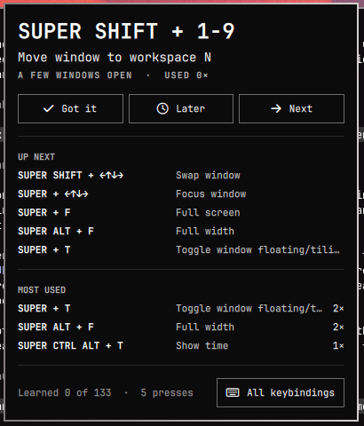

# Key hints for Omarchy

A bar widget for [Omarchy](https://omarchy.org/) that teaches you its keybindings
one at a time. It shows a single binding in the bar, picks the one that fits
what you're doing right now, and stops showing bindings once you actually use
them.




## What it does

- **One hint in the bar** — `SUPER + ←↑↓→ → Focus window`, that sort of thing.
  Families of bindings collapse into one hint (`SUPER + 1-9 → Switch to
  workspace N`) instead of ten near-identical ones.
- **Contextual** — an empty workspace suggests the terminal, launcher and
  browser; a couple of windows open suggests focus/swap/split/full-width; a
  busy workspace suggests moving windows between workspaces; a floating
  window suggests float/pin toggles. Otherwise it rotates through the most
  important bindings you haven't learned yet, every ten minutes.
- **Learns from you** — every keybinding press is logged. A binding drops out
  of rotation after 15 uses (or 5 in a week), and using the binding that's
  on screen moves straight to the next one.
- **Popup** with the current suggestion, what's up next, your most-used
  bindings with counts, and a running "learned N of M" score.

Everything is read from Omarchy's own annotated binding list
(`omarchy menu keybindings --print`), so your personal bindings are included
and nothing is hard-coded.

## Install

```bash
omarchy plugin add https://github.com/ThreeAcresAgency/omarchy-keyhints.git --enable
~/.config/omarchy/plugins/brendan.keyhints/install-tracker.sh
```

The second step installs the usage tracker. Omarchy's plugin installer only
copies files, so the tracker — a few lines of Lua that wrap `hl.bind` and log
each press — has to be added to your Hyprland config separately. The script
copies `hypr/keyhints.lua` to `~/.config/hypr/` and adds
`require("hypr.keyhints")` to `hyprland.lua` just ahead of the Omarchy
defaults, so every binding passes through it. It backs up `hyprland.lua`
first and is safe to run more than once.

Without the tracker the widget still works, but hints only rotate on a timer
and nothing is ever marked learned automatically.

Move the widget wherever you like:

```bash
omarchy bar move brendan.keyhints --section left
```

## Using it

| Action | Bar label | Popup |
|---|---|---|
| Left click | Open the popup | — |
| Middle click / scroll | Next / previous suggestion | — |
| Right click | Full keybindings list (`Super + K`) | — |
| **Got it** | — | Mark learned, never show again |
| **Later** | — | Hide for four hours |
| **Next** | — | Step the rotation |
| Arrow keys / Enter / Esc | — | Next-prev / got it / close |

From a terminal (`~/.config/omarchy/plugins/brendan.keyhints/keyhints.py`):

```bash
keyhints.py stats             # usage leaderboard and learned count
keyhints.py unlearn "Full width"   # put a binding back in rotation
keyhints.py reset             # forget manual learned/snoozed state, keep the log
omarchy-shell brendan.keyhints toggle   # open/close the popup over IPC
```

## Tuning

Everything lives at the top of `keyhints.py`:

- `LEARNED_TOTAL`, `LEARNED_RECENT`, `RECENT_WINDOW` — when a binding counts as
  learned.
- `ROTATE_SECONDS`, `ROTATION_POOL` — how often the non-contextual hint changes
  and how many of the most important unlearned bindings take part.
- `RULES` — a list of `(regex, tier, contexts)` that ranks binding families
  and says which contexts they belong to. Anything unmatched lands in the
  last tier.

The plugin hot-reloads when you save.

## Files

| File | Purpose |
|---|---|
| `manifest.json` | Omarchy plugin manifest (`bar-widget`) |
| `KeyHints.qml` | The bar label and popup (Quickshell) |
| `keyhints.py` | Picks the hint; reads the log, bindings and Hyprland state |
| `hypr/keyhints.lua` | The usage tracker installed into `~/.config/hypr/` |
| `install-tracker.sh` | Installs/uninstalls the tracker (`--uninstall`) |

State lives in `~/.local/state/omarchy/keyhints/` (`usage.log`, `state.json`).

## Uninstall

```bash
~/.config/omarchy/plugins/brendan.keyhints/install-tracker.sh --uninstall
omarchy plugin remove brendan.keyhints
rm -r ~/.local/state/omarchy/keyhints   # optional
```

## Notes

- Mouse-drag binds (`SUPER + mouse`) and repeating binds (volume, brightness)
  are not wrapped by the tracker, so they never appear as hints or counts.
- Requires the Lua Hyprland config Omarchy ships (`~/.config/hypr/hyprland.lua`).

MIT licensed.
